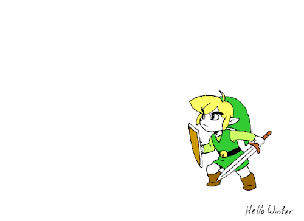

<section class="start-screen" align="center">
  

    
  

  

    

      
      
      
      
      
    

    

      
    

  

  <h1> Hi there 👋 </h1>
</section>
<section class="about-me">

  <table align="center" width="100%">
    <tr>
      <td align="left" width="50%">
        <h3>:woman_technologist: About Me </h3>
        

          My name is Xeniya, and I am a Front-End Developer from <b>Astana, Kazakhstan</b>, currently living in <b>California, USA</b>.
        

      </td>
      <td align="right" width="50%">
        
      </td>
    </tr>
  </table>
</section>

